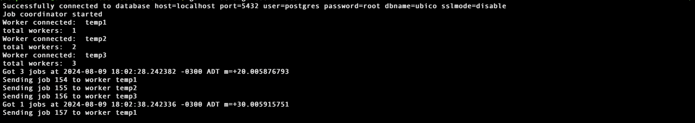
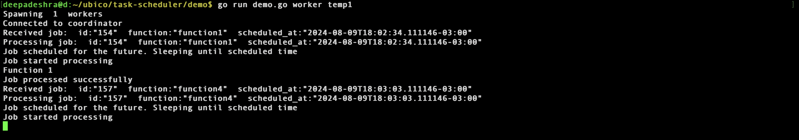
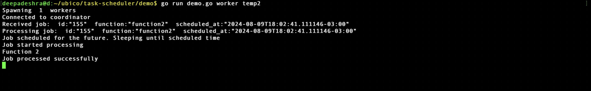
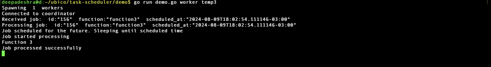

Inspired by : https://jyotinder.substack.com/p/designing-a-distributed-task-scheduler

# Designing a Distributed Task Scheduler using Golang

## Introduction
The goal of this project is to demonstrate how to design a distributed task scheduler. Project is not intended to be a production-ready system, but rather a learning experience to understand the key components and challenges of building a distributed task scheduler.

In this project I have demonstrated advance Golang concepts like channels, go routines, and concurrency patterns to build a distributed task scheduler.

The task scheduler is responsible for scheduling tasks across multiple nodes in a distributed system. The scheduler should be able to handle task scheduling, task execution, and task monitoring. The scheduler should be fault-tolerant and scalable.


## Architecture
The architecture of the distributed task scheduler consists of the following components:
1. Co-ordinator : Responsible for sending tasks to workers and monitoring the status of tasks. It sends tasks to workers and receives status updates from workers. For load balancing it uses Round Robin algorithm.

2. Worker: Acts on the tasks sent by the co-ordinator.
3. Scheduler: User-facing API to create scheduled tasks.

## Usage (WIP)

### Start the Co-ordinator
```bash
go run demo/demo.go coordinator
```

### Start the Worker
```bash
go run demo/demo.go worker worker_name
```

### Start the Scheduler
```bash
go run demo/demo.go scheduler
```

In scheduler you will be able to create/update/delete tasks and schedule them. using this commands
```bash
		CREATE JOB job1 hello_world 2021-01-01T00:00:00Z
		UPDATE JOB job1 hello_world_updated 2021-01-01T00:00:00Z
		DELETE JOB job1
		GET JOB job1
```

## Demo
### Co-ordinator


### Worker-1


### Worker-2


### Worker-3
